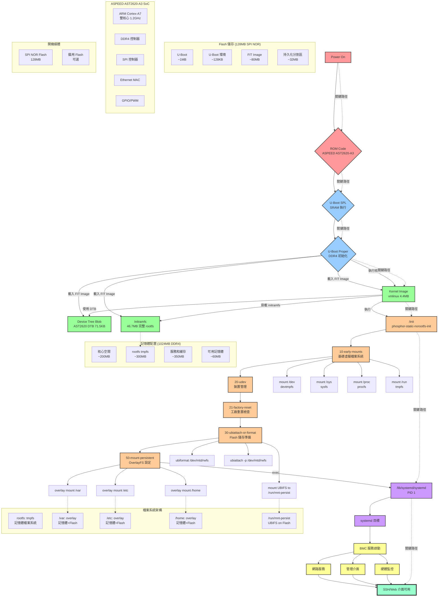

## 開機時序詳細說明

### 階段 1: 硬體初始化 (0-2 秒)
- **ROM Code**: ASPEED AST2600 內建 ROM 程式碼執行
- **U-Boot SPL**: 在有限的 SRAM 中執行，初始化 DDR4
- **U-Boot Proper**: 完整的 U-Boot，準備載入作業系統

### 階段 2: 系統載入 (2-5 秒)  
- **FIT Image 載入**: 單一映像檔包含核心、DTB、完整 rootfs
- **記憶體配置**: initramfs 解壓縮到 tmpfs，成為唯一的根檔案系統
- **核心啟動**: Linux 核心初始化硬體和記憶體管理

### 階段 3: 檔案系統初始化 (5-8 秒)
- **基礎掛載**: devtmpfs, sysfs, procfs, tmpfs 虛擬檔案系統
- **裝置初始化**: udev 掃描和建立裝置節點
- **持久化準備**: UBIFS 格式化或掛載 Flash 分割區

### 階段 4: OverlayFS 配置 (8-10 秒)
- **選擇性持久化**: 只有 /var, /etc, /home 使用 overlay 掛載
- **混合儲存**: 上層寫入 Flash，下層讀取記憶體
- **透明操作**: 應用程式無法察覺 overlay 機制

### 階段 5: 系統服務啟動 (10-15 秒)
- **systemd 接管**: PID 1 轉換為 systemd
- **並行啟動**: BMC 特定服務和網路服務
- **就緒狀態**: SSH 和 Web 管理介面可用

## 關鍵技術特點

### ✅ 無 switch_root 設計
- **傳統方式**: initramfs → switch_root → 真實 rootfs
- **Yosemite4**: initramfs 即為完整且唯一的 rootfs
- **優勢**: 簡化開機流程，提高穩定性

### 🔄 混合儲存架構
- **系統檔案**: 完全在記憶體 (tmpfs)，快速且唯讀
- **資料檔案**: 透過 OverlayFS 持久化到 Flash
- **工廠重置**: 清除 Flash 分割區即可恢復初始狀態

### 💾 記憶體最佳化
- **壓縮儲存**: initramfs 使用 gzip/lzma 壓縮
- **按需載入**: 程式和函式庫動態載入到記憶體
- **共享頁面**: 相同檔案在多程序間共享記憶體
```
